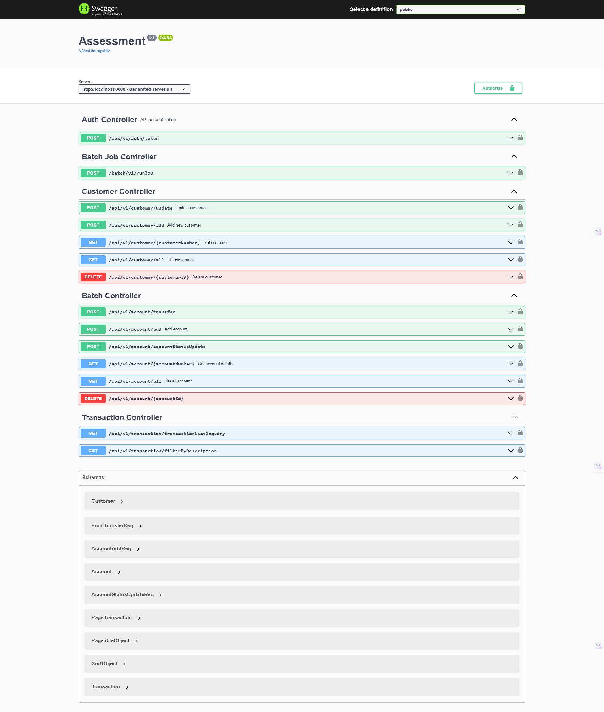
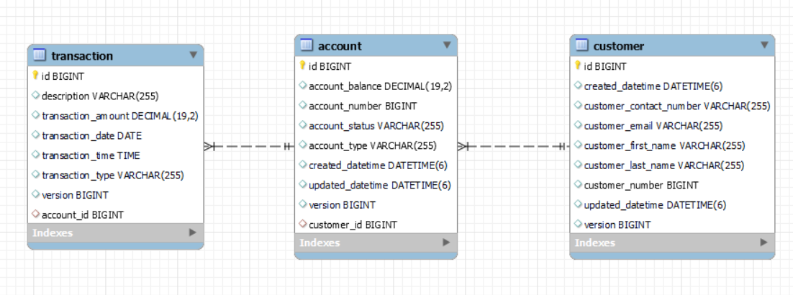
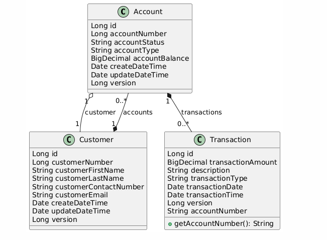
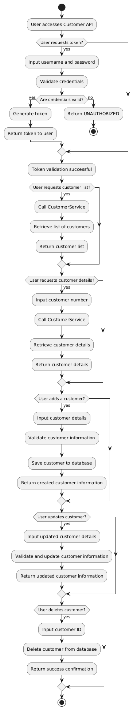
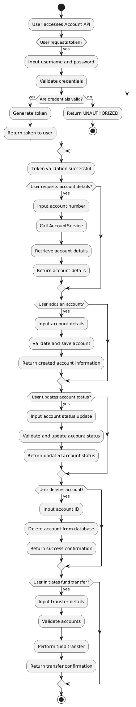
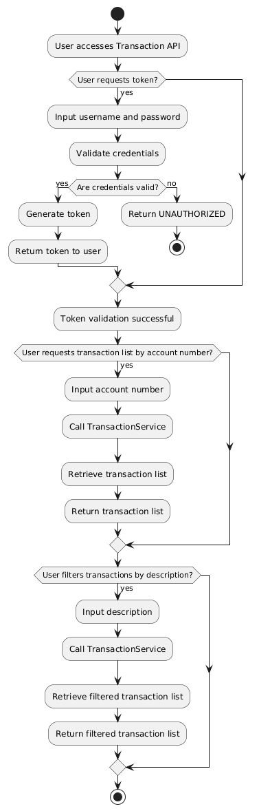

# Technical Assessment Banking Application

**1. Batch job to consume**

**2. RESTful API to with below criteria**

*	Authenticate - with OAuth2.0
*	Support pagination
*	RESTful with CRUD operation
*	Concurrent updates with optimistic locking (versioning)

## Application Packages

1. maybank-api - RESTful apis
2. maybank-batch - Batch job to consume
3. maybank-base - Common classes
4. maybank-main - Main application


## MySQL Database
```
CREATE DATABASE mb_db;
CREATE USER 'mb_db'@'%' IDENTIFIED BY 'mb_db';
GRANT ALL PRIVILEGES ON mb_db.* TO 'mb_db'@'%' WITH GRANT OPTION;
```

## Swagger
RESTful api documentation
```html
http://localhost:8080/swagger-ui/index.html#/
```



# Extra notes

## 1.  Database structure


## 2.  Design pattern used

**Observable Pattern**
 
The LoggingAspect class acts as an observer for controller method calls. Using the @Before advice in AOP, we can observe and respond to every method invocation in com.assessment.maybank.controller.
```java
@Aspect
@Component
public class LoggingAspect {
    
    private static final Logger log = LoggerFactory.getLogger(LoggingAspect.class);

    @Before("execution(* com.assessment.maybank.controller..*(..))")
    public void logAfterControllerCall(JoinPoint joinPoint) {
        String methodName = joinPoint.getSignature().getName();
        log.info("Method called: {}", methodName);
    }
}
```

**Repository Pattern**

Spring Data JPA generates the required SQL automatically based on method names, aligning with the Repository pattern's goal of keeping data access code minimal and clear.
```java
@Repository
public interface TransactionRepository extends JpaRepository<Transaction, Long> {

    Page<Transaction> findByDescriptionContainingAndTransactionType(String description,String transactionType, Pageable pageable);

    Page<Transaction> findByAccount_AccountNumberAndTransactionType(Long accountNumber,String transactionType, Pageable pageable);

}
```

**Service Pattern**
The service layer enables easy testing and modification of business rules without affecting the data access layer.
```java 
@Service
public class AccountService {

    @Autowired
    private AccountRepository accountRepository;

    public List<Account> getAccountList() {
        List<Account> accountList = accountRepository.findAll();
        return accountList;
    }
}
```

## 3.Class diagram


## 4. Acitivity diagram

**Customer**



**Account**



**Transaction**

